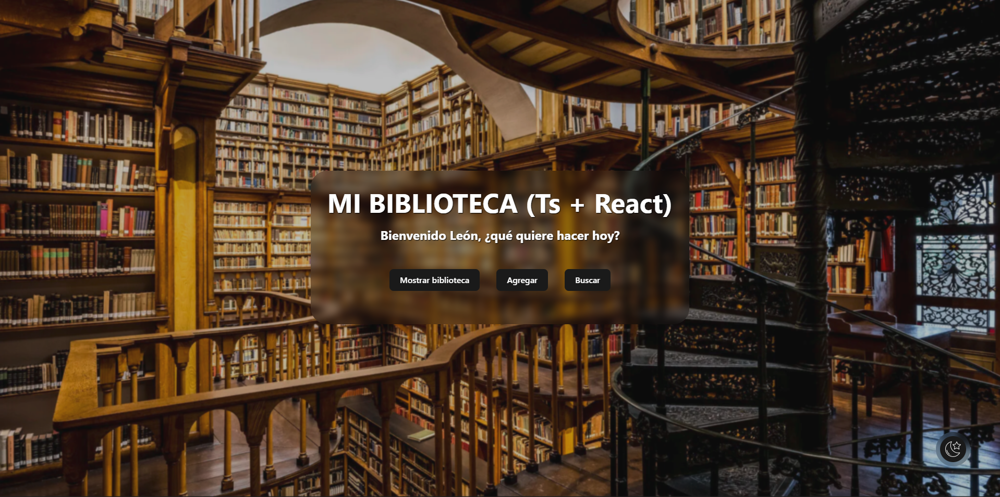
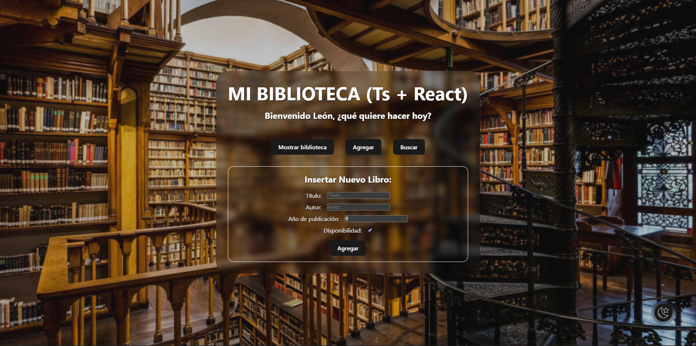
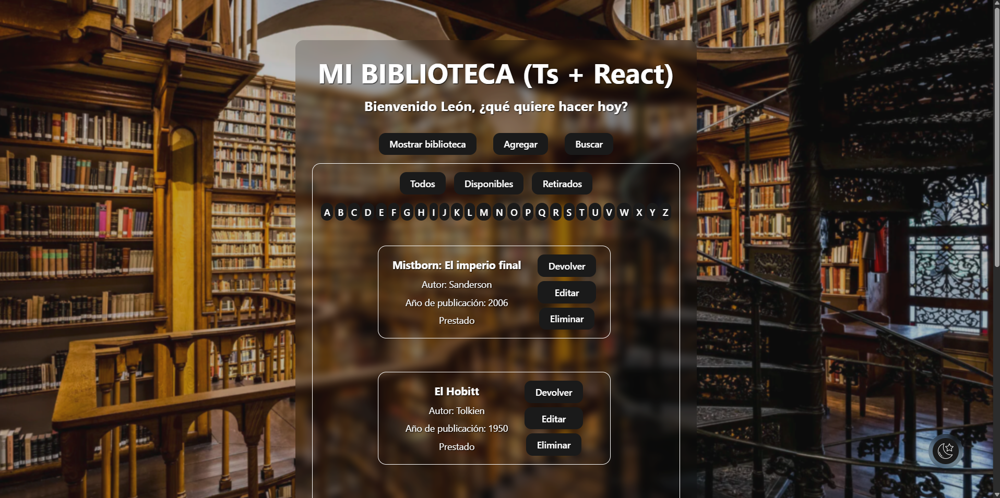

# Biblioteca de Componentes en React + TypeScript

Biblioteca de componentes en React y TypeScript, diseñada para construir **interfaces modulares, reutilizables y tipadas de forma consistente**.  
Perfecta como base para proyectos frontend escalables y bien estructurados.

---

## Tecnologías

- React
- TypeScript
- Vite
- Node.js

---

## Objetivos

- Desarrollar componentes reutilizables y escalables.
- Aplicar tipado fuerte con TypeScript.
- Seguir un enfoque modular y mantenible.
- Mantener el proyecto en evolución continua como parte de un portfolio profesional.
- Demostrar buenas prácticas en desarrollo frontend moderno.

---

## Capturas del Proyecto

### Pantalla principal


### Formulario de agregar libro


### Mostrar libros


---

## Estructura del proyecto
```
src/
├─ assets/            # Imágenes y recursos
├─ components/        # UI y funcionalidades
│  ├─ acciones/       # Botones y acciones sobre libros
│  ├─ buscador/       # Buscador de libros
│  ├─ formularios/    # Formularios de agregar/editar
│  ├─ libro/          # Tarjeta de libro
│  ├─ Panel-control/  # Panel de administración
│  └─ saludo/         # Componente de bienvenida
├─ contexts/          # Context API para libros
├─ types/             # Interfaces y tipos TypeScript
├─ App.tsx
└─ main.tsx

# Archivos raíz
.gitignore
README.md
index.html
package.json
tsconfig.json
vite.config.ts
```
---

## Instalación

1. Clonar el repositorio:
   `git clone https://github.com/LeonGinel/react-biblioteca.git`

2. Instalar dependencias:
   `npm install`

3. Ejecutar en desarrollo:
   `npm run dev`

---

## Estado

Proyecto en evolución continua, con incorporación progresiva de nuevos componentes y mejoras.  
Ideal para probar y extender en otros proyectos frontend.

---

## Autor

León – Desarrollador Frontend  
[GitHub](https://github.com/LeonGinel) | [LinkedIn](https://linkedin.com/in/leonginel)
