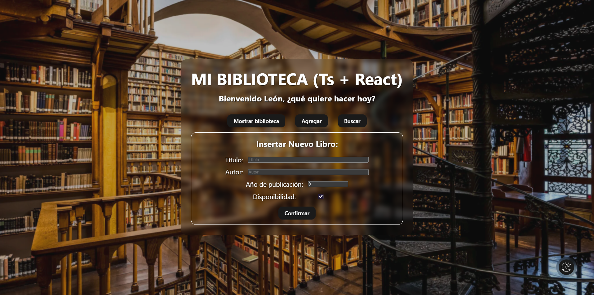
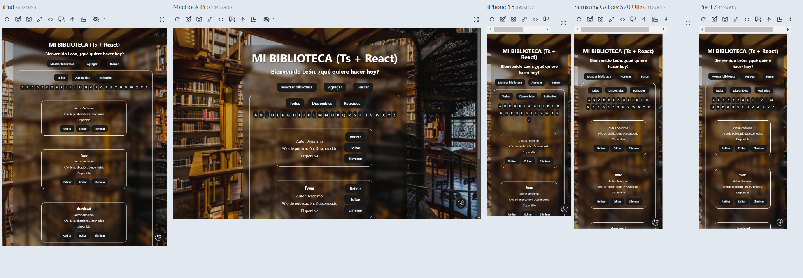

# Biblioteca de Componentes en React + TypeScript

Biblioteca de componentes en React y TypeScript, diseñada para construir **interfaces modulares, reutilizables y tipadas de forma consistente**.  
Perfecta como base para proyectos frontend escalables y bien estructurados.

🔗 **Demo online:** [Biblioteca React + TS](https://biblioteca-react-ts.netlify.app/)

---

## Estado y notas importantes

Este proyecto está **activo y en desarrollo**, con incorporación progresiva de nuevos componentes y mejoras.  
Ideal para probar y extender en otros proyectos frontend.

Algunas de las características y mejoras planificadas incluyen:

- Diseño **responsive** para adaptarse a móviles, tablets y escritorio. ✅  
- Implementación de **validaciones y medidas de seguridad**.
- Funcionalidades de **login y registro de usuarios**.
- Integración de **más productos**: películas, series, juegos, etc.
- **Opción de descarga** de contenidos o datos.
- Y muchas otras mejoras y funcionalidades adicionales (**ETC**).

Estas actualizaciones reflejan el trabajo activo en el proyecto y su crecimiento progresivo.

---

## Capturas del Proyecto

### Formulario de agregar libro


### Búsqueda


### Mostrar libros


### Tema oscuro


### Diseño Responsive


---

## Tecnologías

- React
- TypeScript
- Vite
- Node.js

---

## Objetivos

- Desarrollar componentes **reutilizables y escalables**.  
- Aplicar **tipado fuerte con TypeScript** para mayor seguridad y mantenibilidad.  
- Seguir un enfoque **modular y fácil de mantener**.  
- Mantener el proyecto en **evolución continua** como parte de un portfolio profesional.  
- Demostrar **buenas prácticas en desarrollo frontend moderno**.
- Garantizar un **diseño responsive**, optimizado para cualquier dispositivo. ✅  

---

## Funcionalidades principales

- Agregar, editar y eliminar libros.  
- Cambiar disponibilidad de libros (**retirar / devolver**).  
- Filtrado de libros por estado y por letra inicial.  
- Buscador en tiempo real.  
- Cambio de tema **claro / oscuro**.  
- Panel de control con selección de secciones.  
- Estado persistente usando **LocalStorage**.
- Soporte completo **responsive**, adaptándose a móviles, tablets y escritorio. ✅

---

## Estructura del proyecto
```
src/
├─ assets/            # Imágenes y recursos
├─ components/        # UI y funcionalidades
│  ├─ acciones/       # Botones y acciones sobre libros
│  ├─ buscador/       # Buscador de libros
│  ├─ cambiar-tema/   # Cambiar entre modo claro y oscuro
│  ├─ formularios/    # Formularios de agregar/editar
│  ├─ libro/          # Tarjeta de libro
│  ├─ Panel-control/  # Panel de administración
│  └─ saludo/         # Componente de bienvenida
├─ contexts/          # Context API para libros
├─ types/             # Interfaces y tipos TypeScript
├─ App.tsx
└─ main.tsx

# Archivos raíz
.gitignore
README.md
index.html
package.json
tsconfig.json
vite.config.ts
```
---

## Instalación 

1. Clonar el repositorio:
   `git clone https://github.com/LeonGinel/react-biblioteca.git`

2. Instalar dependencias:
   `npm install`

3. Ejecutar en desarrollo:
   `npm run dev`

---

## Autor 

León – Desarrollador Frontend  
[GitHub](https://github.com/LeonGinel) | [LinkedIn](https://linkedin.com/in/leonginel)
